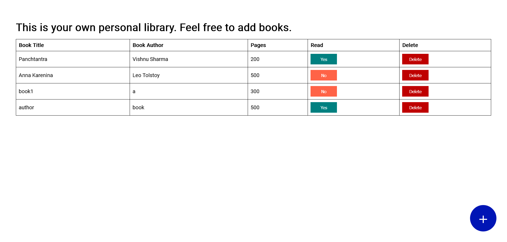

# Library

This is a assignment project of [Odin Project](https://www.theodinproject.com/lessons/node-path-javascript-library).

Live-preview : [website-link](https://akanksha493.github.io/Library/) 

Screenshot:

### Useful Resources
Some of the resources I used while building this :

1. [localStorage-javascript.info](https://javascript.info/localstorage)
2. [html forms- w3school](https://www.w3schools.com/html/html_forms.asp), [html dialog-mdn docs](https://developer.mozilla.org/en-US/docs/Web/HTML/Element/dialog), [html dialog- web.dev](https://web.dev/learn/html/dialog)
3. Similar projects that helped me a lot:[ginnerzapata-library](https://github.com/ginnerzapata/library-app/tree/master), [CatQueenCodes - library](https://github.com/CatQueenCodes/Project-Library/tree/master)
